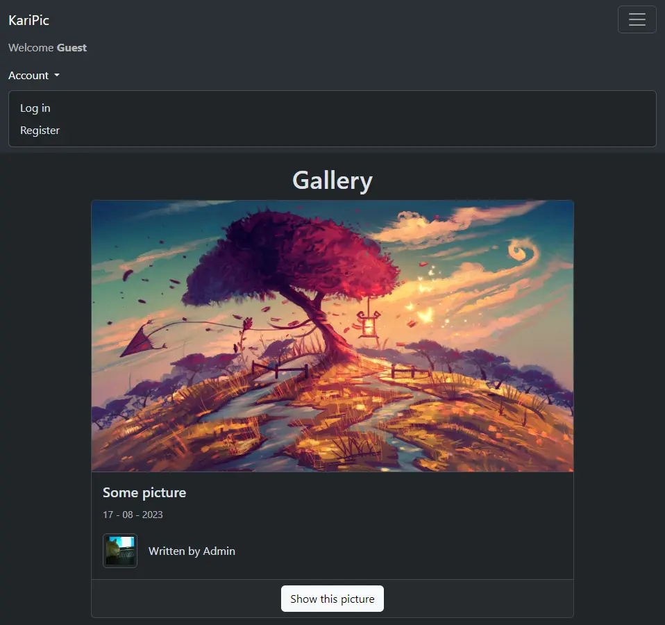
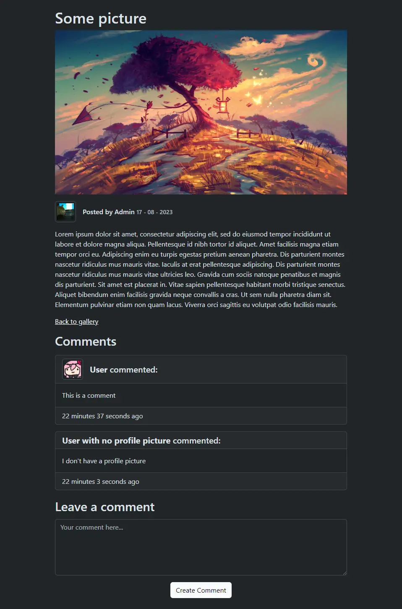
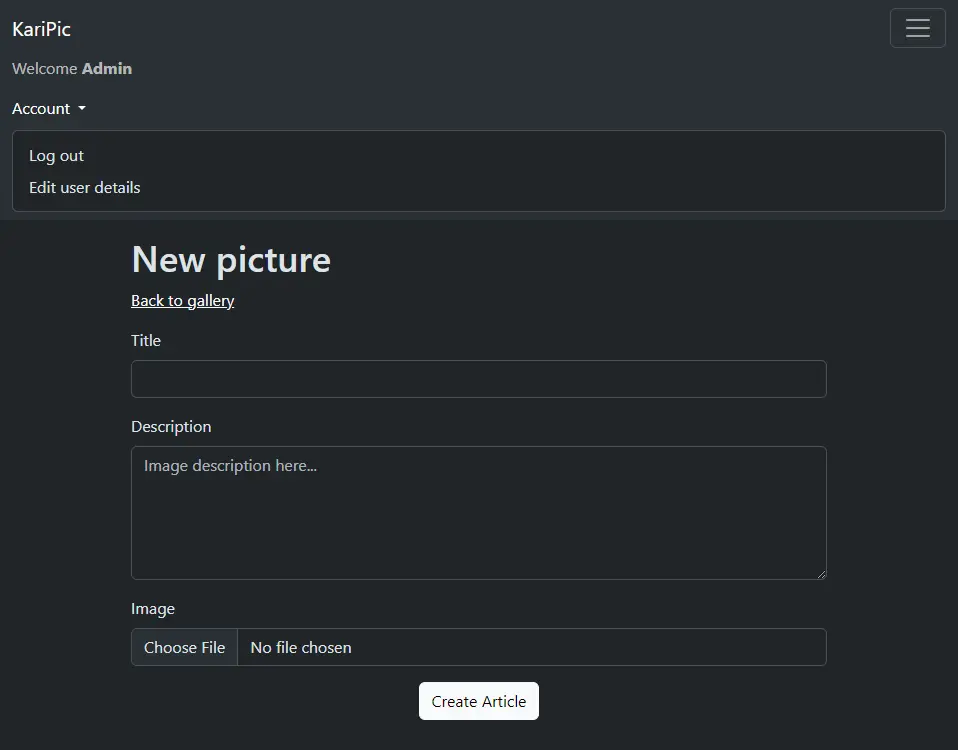
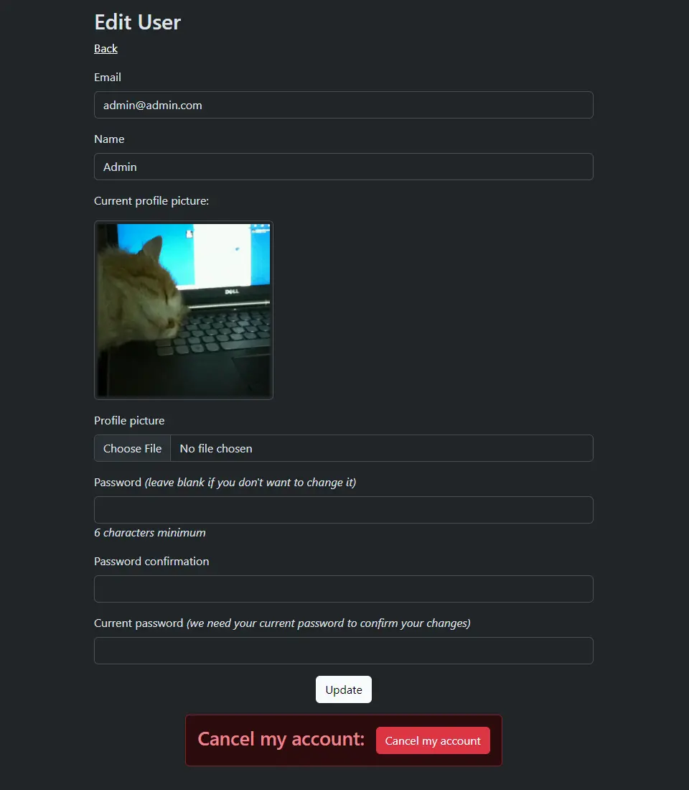

# KariPic

Web app for a photographer who wants a platform to exhibit their pictures and for users to be able to comment on them.

## Description

Image blog web app with a fully functioning user authentication system set up using Devise. There are 2 roles available: **User**, who can view articles and comment on them and **Admin**, who can create, edit and delete them. Guests can only view articles and the comments in them.

To host the article images and user profile pictures the app uses Amazon's S3 service.

## Views

### Index


### Show


### New


### User details


## Deploy on Heroku via CLI

* Log in using ```heroku login```
* Create app using ```heroku create```
* Connect to app using ```heroku git:remote -a app_name```
* Upload app using ```git push heroku main```
* Run migrations using ```heroku run rails db:migrate```
* Configure environment variables for Amazon S3 in Heroku's app settings:
    * Access key ID in ```aws_access_key_id```
    * Secret access key in ```aws_secret_access_key```
    * Bucket region in ```aws_bucket_region```
    * Bucket name in ```aws_bucket_name```
* Create or update an admin account:
    * Launch a Rails console with ```heroku run rails console```
    * Create an **Admin** account with ```User.create(email:"your@email.com", password:"your_password", name:"your_name", role:"admin")```
    * Or modify an existing account with the following commands
        ```ruby
        admin = User.find(your_user_id)
        admin.update(role:"admin")
        ```


## Software used

* [Ruby 3.2.2](https://www.ruby-lang.org/en/)  
* [Rails 7.0.6](https://rubyonrails.org/)  
* [PostgreSQL 14.8](https://www.postgresql.org)  
* [Bootstrap 5.3.1](https://getbootstrap.com/)  

### Gems

* [Annotate 3.2.0](https://github.com/ctran/annotate_models)  
* [Devise 4.9.2](https://github.com/heartcombo/devise)  
* [AWS SDK S3 1.132](https://github.com/aws/aws-sdk-rails)

## Possible improvements

* Article search with [PgSearch](https://github.com/Casecommons/pg_search)  
* Pagination with [Pagy](https://github.com/ddnexus/pagy)  
* Role permission tests  
* Active storage validation  
* Image processing for uploaded images  
* Mailer setup
